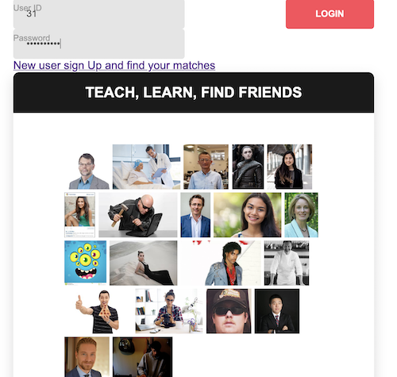

# HobbyExchange 
## Teach, Learn, Make Friends.

Try on the Heroku implementation 
<a href="https://arcane-brook-35810.herokuapp.com/"> https://arcane-brook-35810.herokuapp.com/</a>

Hobby Exchange is a web application where users enter skills that they have and skills that they want to learn.  For example, if user 1 wants to learn guitar and is good at surfing, he or she can be matched to user 2 who can teach guitar and wants to learn surfing.    Each user will list several skills that they have and several skills that they want to learn.   Then when there is a match, the user will will be notified and will be able to contact their teacher/ student to meet up and exchange skills.



---
A user can create an account by filling in the basic information, and pick hobbies he/she can teach, and pick hobbies he/she wants to learn from others. The program will find the mutual matched users from the database. The user can contact the mached users to teach the skills he/she has and learn new skills from the matched users.    

---

## Programming
This program is a full stack web implementation using <b><u>Sequelize</u></b>.  Four database tables are created to accommodate for future growing and changes.

### database Models
```
Users : Id, name, email, photo,...
Hobbies: Id, hobby name
Teach: User_id, Hobby_id 
       (A  many-to-many reference table for users to match hobbies he/she can teach )
Learn: User_id, Hobby_id 
       (A  many-to-many reference table for users to match hobbies he/she can learn ) 
```

### API Routes 

```
get /api/hobbies                  -- list all hobbies   

post /api/hobbies                -- create multiple hobbies

post /api/users                   -- Create a new user, learn table, teach table and publish match 

get /api/users/:userid            -- get one user's information

post /api/users/:userid/skills    -- create a skill set (what he/.she can teach) for a specific user

post /api/users/:userid/needs     -- create a need set (what he/she wants to learn) for a specific use

get /api/users/:userid/teachto    -- match one user's needs to other users' skill sets. 
                                     Return a list of users and their skills can for a specific user(:userid)  

get /api/users/:userid/learnfrom  -- match one user's skill set to other users' needs. 
                                     Return a list of users he/she needs to teach

```


<a href="https://arcane-brook-35810.herokuapp.com/"> Test The Program </a>

